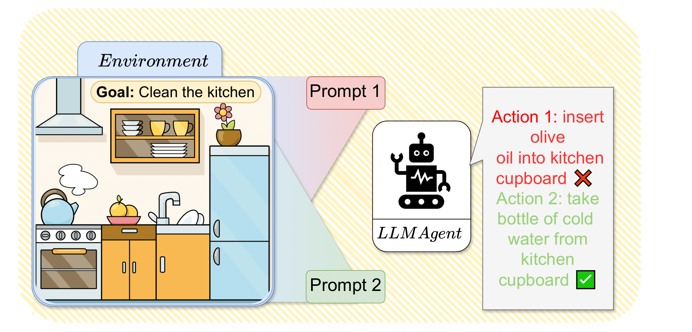

# Quantifying-and-Mitigating-Prompt-Overfitting
This repository contains the code used for our paper: Reinforcement Learning for Aligning Large Language Models Agents with Interactive Environments: Quantifying and Mitigating Prompt Overfitting

# Installation steps
1. Create Python Environment
 
       conda create -n dlp python=3.10.8; conda activate EMNLP
2. Install packages required

       pip install -r requirements.txt
3. Install Simulation Environment
* BabyAI-Text:

       pip install blosc; cd babyai-text/babyai; pip install -e .; cd ..
       cd gym-minigrid; pip install -e.; cd ..
       pip install -e .
* TWC:
  
       pip install textworld
       git clone https://github.com/IBM/commonsense-rl
       cd commonsense-rl/game_generation
       # Create TWC Levels 
       python twc_make_game.py --level medium --num_games 10000
       cd ../..
4. Install Lamorel

       git clone https://github.com/flowersteam/lamorel.git; cd lamorel/lamorel; pip install -e .; cd ../..
# Training a Language Model
## TWC:
### Train single strategy $P_i$:
### Train single strategy $P_{all}$:
### Train single strategy $Contrastive_{P_i}$:

