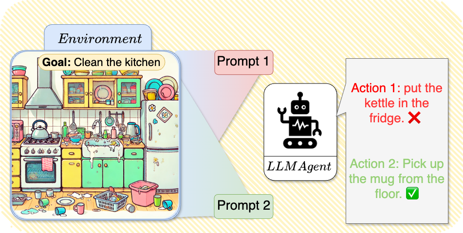

# Quantifying-and-Mitigating-Prompt-Overfitting
This repository contains the code used for our paper: Reinforcement Learning for Aligning Large Language Models Agents with Interactive Environments: Quantifying and Mitigating Prompt Overfitting

# Installation steps
1. Create Python Environment
 
       conda create -n dlp python=3.10.8; conda activate EMNLP
2. Install packages required

       pip install -r requirements.txt
3. Install Simulation Environment
* BabyAI-Text:

       pip install blosc; cd babyai-text/babyai; pip install -e .; cd ..
       cd gym-minigrid; pip install -e.; cd ..
       pip install -e .
* TWC:
  
       pip install textworld
       git clone https://github.com/IBM/commonsense-rl
       cd commonsense-rl/game_generation
       # Create TWC Levels 
       python twc_make_game.py --level medium --num_games 10000
       # or download from: https://drive.usercontent.google.com/download?id=17runadDr1FsoF9xAFiGcL7XWkv9UrRHW&export=download&authuser=0
       wget -O "TWC-medium.zip" "https://drive.usercontent.google.com/download?id=17runadDr1FsoF9xAFiGcL7XWkv9UrRHW&export=download&authuser=0&confirm=t&uuid=a2c7fdc8-3171-4204-9721-e229544c52c5&at=APZUnTVC_aFsAa7I_dU3-nt0a77D%3A1718460781880"
       unzip TWC-medium.zip
       cd ../..
4. Install Lamorel

       git clone https://github.com/flowersteam/lamorel.git; cd lamorel/lamorel; pip install -e .; cd ../..
# Training a Language Model
## TWC:
### Train single strategy $P_i$:
        python3 -m lamorel_launcher.launch --config-path "./experiments/TWC/configs/custom/" 
                   --config-name "local_gpu_config"        
                   rl_script_args.path="/experiments/TWC/main_pi.py"
                   rl_script_args.output_dir="." 
                   lamorel_args.accelerate_args.machine_rank=0 
                   rl_script_args.gradient_batch_size=4 
                   lamorel_args.llm_args.model_path="google/flan-t5-small"  
                   rl_script_args.prompt_id=0 # P_i number from 0 to 3 
                   rl_script_args.seed= 1   
                   lamorel_args.llm_args.model_type="seq2seq"
                   rl_script_args.twc_levels= ./TWC-Medium #Directory of twc levels downloaded or created
### Train single strategy $P_{all}$:
        python3 -m lamorel_launcher.launch --config-path "./experiments/TWC/configs/custom/" 
                   --config-name "local_gpu_config"        
                   rl_script_args.path="/experiments/TWC/main_pAll.py"
                   rl_script_args.output_dir="." 
                   lamorel_args.accelerate_args.machine_rank=0 
                   rl_script_args.gradient_batch_size=4 
                   lamorel_args.llm_args.model_path="google/flan-t5-small"  
                   rl_script_args.prompt_id=0 # useless we train on all prompts 
                   rl_script_args.seed= 1   
                   lamorel_args.llm_args.model_type="seq2seq"
                   rl_script_args.twc_levels= ./TWC-Medium #Directory of twc levels downloaded or created
### Train single strategy $Contrastive_{P_i}$:
        python3 -m lamorel_launcher.launch --config-path "./experiments/TWC/configs/custom/" 
                   --config-name "local_gpu_config"        
                   rl_script_args.path="/experiments/TWC/main_Contrastive.py"
                   rl_script_args.output_dir="." 
                   lamorel_args.accelerate_args.machine_rank=0 
                   rl_script_args.gradient_batch_size=4 
                   lamorel_args.llm_args.model_path="google/flan-t5-small"  
                   rl_script_args.prompt_id=0 # P_i number from 0 to 3 , Contrastive applied to all others
                   rl_script_args.seed= 1   
                   lamorel_args.llm_args.model_type="seq2seq"
                   rl_script_args.twc_levels= ./TWC-Medium #Directory of twc levels downloaded or created
## BabyAI-Text:
### Train single strategy $P_i$:
        python3 -m lamorel_launcher.launch --config-path "./experiments/TWC/configs/custom/" 
                   --config-name "local_gpu_config"        
                   rl_script_args.path="/experiments/BabyAI-Text/main_pi.py"
                   rl_script_args.output_dir="." 
                   lamorel_args.accelerate_args.machine_rank=0 
                   rl_script_args.gradient_batch_size=4 
                   lamorel_args.llm_args.model_path="google/flan-t5-small"  
                   rl_script_args.prompt_id=0 # P_i number from 0 to 3 
                   rl_script_args.seed= 1   
                   lamorel_args.llm_args.model_type="seq2seq"
### Train single strategy $P_{all}$:
        python3 -m lamorel_launcher.launch --config-path "./experiments/BabyAI-Text/configs/custom/" 
                   --config-name "local_gpu_config"        
                   rl_script_args.path="/experiments/TWC/main_pAll.py"
                   rl_script_args.output_dir="." 
                   lamorel_args.accelerate_args.machine_rank=0 
                   rl_script_args.gradient_batch_size=4 
                   lamorel_args.llm_args.model_path="google/flan-t5-small"  
                   rl_script_args.prompt_id=0 # useless we train on all prompts 
                   rl_script_args.seed= 1   
                   lamorel_args.llm_args.model_type="seq2seq"
### Train single strategy $Contrastive_{P_i}$:
        python3 -m lamorel_launcher.launch --config-path "./experiments/TWC/configs/custom/" 
                   --config-name "local_gpu_config"        
                   rl_script_args.path="/experiments/BabyAI-Text/main_Contrastive.py"
                   rl_script_args.output_dir="." 
                   lamorel_args.accelerate_args.machine_rank=0 
                   rl_script_args.gradient_batch_size=4 
                   lamorel_args.llm_args.model_path="google/flan-t5-small"  
                   rl_script_args.prompt_id=0 # P_i number from 0 to 3 , Contrastive applied to all others
                   rl_script_args.seed= 1   
                   lamorel_args.llm_args.model_type="seq2seq"
# Evaluation
